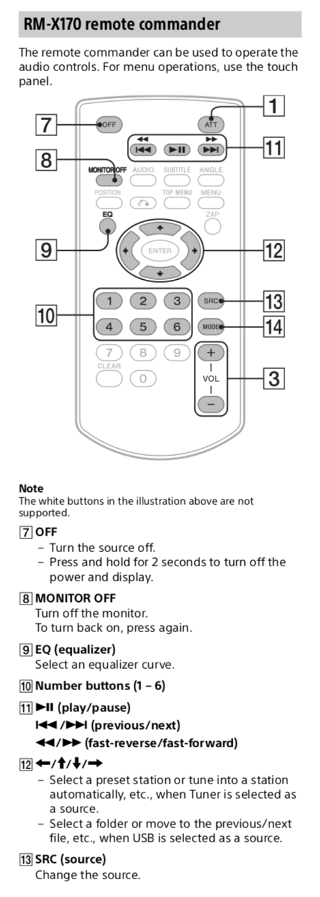
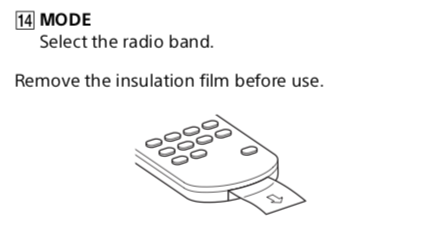

# Sony RM-X170


[Model # RM-X170](https://esupport.sony.com/US/p/model-home.pl?mdl=RMX170&LOC=3)


The RM-X170 is part of a product bundle

- [XAV-60 - Double DIN A/V Center](https://esupport.sony.com/US/p/model-find.pl?mdl=XAV-60&template_id=1)
- [XAV-622 - AV Center](https://esupport.sony.com/US/p/model-find.pl?mdl=XAV-622&template_id=1)
- [XAV-63 - AV Center](https://esupport.sony.com/US/p/model-find.pl?mdl=XAV-63&template_id=1)
- [XAV-64BT - AV Center](https://esupport.sony.com/US/p/model-find.pl?mdl=XAV-64BT&template_id=1)
- [XAV-70BT - Double DIN CD Receiver](https://esupport.sony.com/US/p/model-find.pl?mdl=XAV-70BT&template_id=1)
- [XAV-72BT - AV Receiver with Bluetooth®](https://esupport.sony.com/US/p/model-find.pl?mdl=XAV-72BT&template_id=1)
- [XAV-AX100 - 6.4" (16.3 cm) Media receiver with Bluetooth®](https://esupport.sony.com/US/p/model-find.pl?mdl=XAV-AX100&template_id=1)
- [XAV-AX200 - 6.4" (16.3 cm) DVD receiver with Bluetooth®](https://esupport.sony.com/US/p/model-find.pl?mdl=XAV-AX200&template_id=1)
- [XAV-AX5000 - 6.95" (17.6-cm) CarPlay/Android Auto Media Receiver with BLUETOOTH®](https://esupport.sony.com/US/p/model-find.pl?mdl=XAV-AX5000&template_id=1)
- [XAV-W651BT - AV Center Entry 6inch with Bluetooth®](https://esupport.sony.com/US/p/model-find.pl?mdl=XAV-W651BT&template_id=1)
- [XAV-W651BTN - Navigation Bundle (XAVW651BT + XANV400)](https://esupport.sony.com/US/p/model-find.pl?mdl=XAV-W651BTN&template_id=1)


## Codes - RM-X170

Used excellent Arduino-based [IRremote](https://github.com/z3t0/Arduino-IRremote) to decode.

All the codes are either 15-bit Sony or 20-bit Sony codes. Since LIRC has a protocol limitation of one encoding per remote "conf", the values need to be split among two remote definitions.

```
OFF             0x5821 (15 bits)
ATT             0x1421 (15 bits)

PREVIOUS        0x6C21 (15 bits)
FAST_REVERSE    0x
PLAY_PAUSE      0x4E21 (15 bits)
NEXT            0x1C21 (15 bits)
FAST_FORWARD    0x

MONITOR_OFF     0xAA420 (20 bits)
AUDIO           0x7A420 (20 bits)
SUBTITLE        0xBA420 (20 bits)
ANGLE           0xFA420 (20 bits)

POSITION        0x6B21 (15 bits)
RETURN          0x6821 (15 bits)
TOP_MENU        0x9A420 (20 bits)
MENU            0x5A420 (20 bits)

EQ              0x3621 (15 bits)
ZAP             0x2A420 (20 bits)

UP              0x6621 (15 bits)
LEFT            0x5621 (15 bits)
ENTER           0x1D21 (15 bits)
RIGHT           0x1621 (15 bits)
DOWN            0x2621 (15 bits)

1               0x0021 (15 bits)
2               0x4021 (15 bits)
3               0x2021 (15 bits)
SRC             0x3121 (15 bits)

4               0x6021 (15 bits)
5               0x1021 (15 bits)
6               0x5021 (15 bits)
MODE            0x7121 (15 bits)

7               0x3021 (15 bits)
8               0x7021 (15 bits)
9               0x0821 (15 bits)
VOLUME_UP       0x2421 (15 bits)

CLEAR           0x1A420 (20 bits)
0               0x4821 (15 bits)
VOLUME_DOWN     0x6421 (15 bits)
```


## Buttons used by Sony XAV-AX100




